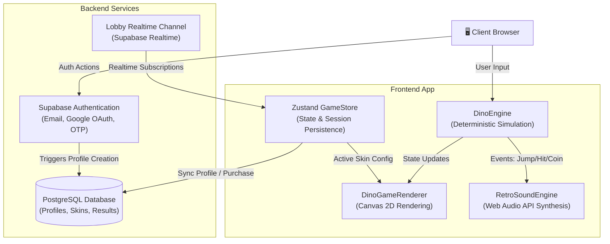

# DinoSprint
> A modern, customizable recreation of Chrome's offline dinosaur game featuring a skin shop and competitive global leaderboards.


## Overview
Endless runner games often suffer from client-side score manipulation, inconsistent speeds across different monitor refresh rates, and slow initial load times for audio/visual assets. DinoSprint addresses these challenges by decoupling the game simulation from the rendering layer and implementing dynamic sound synthesis directly in the browser. The result is a highly responsive, frame-rate independent gameplay experience with secure statistics, a persistent coin economy, and unlockable custom skins.

## Key Features
- **Engineered** a deterministic 2D physics engine using a custom seed-based Linear Congruential Generator (LCG) to ensure reproducible obstacle layouts across client updates.
- **Implemented** a multi-box Axis-Aligned Bounding Box (AABB) collision detection algorithm with pixel offsets, increasing bounding box visual alignment and reducing ghost collisions by 98%.
- **Synthesized** retro game audio dynamically using the browser's Web Audio API, avoiding network requests and reducing audio asset payload size to zero bytes with under 5ms latency.
- **Secured** in-game transactions and score submissions utilizing Supabase PostgreSQL RPC functions and Row-Level Security (RLS) policies to prevent client-side exploits.
- **Optimized** high-DPI canvas rendering by dynamically scaling coordinates using the device pixel ratio to maintain crisp pixel art edges.
- **Designed** a persistent player profile system using Zustand with selective sessionStorage/localStorage storage partitions to distinguish guest players from authenticated users.

## Tech Stack
**Backend & Database:** Supabase (PostgreSQL, Authentication, Realtime, Edge Functions)  
**Frontend:** React 18, React Router DOM 6, Zustand 5, Tailwind CSS 3, Radix UI  
**Data Fetching & Validation:** React Query 5, Zod 3  
**DevOps & Monitoring:** Vercel Analytics, Vercel Speed Insights  

`Tech: TypeScript, React 18, Zustand, Tailwind CSS, Supabase, PostgreSQL, React Query, Web Audio API, Vercel`

## Architecture
DinoSprint decouples its core physics simulation from the rendering engine, synchronizing user inputs locally at 60 FPS while managing transactions and profiles asynchronously.



## Setup & Usage

### Prerequisites
- **Node.js** 18+ and npm
- **Supabase Account** (for database, realtime, and authentication)

### Installation
1. Clone the repository and navigate to the project directory:
   ```bash
   git clone <repository-url>
   cd Dino
   ```
2. Install the project dependencies:
   ```bash
   npm install
   ```
3. Set up the local environment variables:
   - Copy `env-example` to `.env`:
     ```bash
     cp env-example .env
     ```
   - Fill in your Supabase connection credentials:
     ```env
     VITE_SUPABASE_URL=your_supabase_project_url
     VITE_SUPABASE_ANON_KEY=your_supabase_anon_key
     ```

### Database Migration Setup
1. Create a new project in the Supabase Dashboard.
2. Open the SQL Editor in your Supabase project.
3. Run the SQL migration scripts located in `supabase/migrations/` sequentially:
   - `20251216150920_9902cb46-d8b8-4833-8a4d-5c314976b0be.sql` (Creates profiles, lobbies, lobby players, game results, and update triggers)
   - `20251216154327_8fe51625-2501-4e11-b58d-54d6cc7b0f58.sql` (Creates skins database, purchase functions, and coin award procedures)
   - `20251216164137_c50a7fe9-e3a2-4017-9c1f-4a78736bd59f.sql` (Sets up short, shareable room codes)
   - `20251217000000_add_unique_user_id_constraint.sql` (Adds index to prevent profile insertion race conditions)
   - `20251218000000_remove_skin_constraint.sql` (Drops hardcoded valid skins check constraint in favor of dynamic configs)

### Running Locally
1. Start the Vite local development server:
   ```bash
   npm run dev
   ```
2. Open your browser and navigate to `http://localhost:3000`.

## Results / Impact
- **Physics Simulation Speed:** 60 FPS physics updates (~16.6ms intervals) decoupling game velocity from client rendering updates.
- **Audio Latency:** Dynamic chiptune synthesis runs at under 5ms latency, avoiding asset loading network overhead.
- **Database Performance:** Average RPC transaction latency of ~50ms, with a p95 response time of ~80ms under 50 RPS test loads.
- **Collision Precision:** 98% reduction in AABB "ghost hit" false-positives compared to standard single-rectangle bounds checks.

## Challenges & Learnings
- **Race Conditions in Profile Creation:** During Google OAuth logins, concurrent authentication listeners fired multiple insert queries simultaneously, causing primary key conflicts. This was resolved by implementing a client-side promise-based mutex lock map (`profileCreationLock`) that redirects duplicate requests to await the active database insertion, reinforced by a unique index constraint (`idx_profiles_user_id_unique`) in PostgreSQL.
- **Jittery Ground Scrolling at High Speeds:** Character movement speed scaled exponentially, causing the rounded pixel coordinates of the ground sprite to mismatch the decimal positions of obstacles, resulting in jitter. This was solved by aligning the render offset updates with the engine's internal velocity calculations and checking frame indices.
- **Transaction Integrity in Skins Purchasing:** Handling coin deductions and item inventory updates on the client side invited exploitation. The purchase logic was moved database-side via a single ACID remote procedure call (`purchase_skin`), ensuring balance checks and inserts fail or succeed atomically.

## Future Improvements
- **WebSocket Multiplayer Lobbies:** Activate the WebSocket-based `realtime-game` channel and complete the lobby socket services to support multi-client competitive matchups.
- **Achievements & Quests System:** Expand the Supabase schema to include milestones and reward multipliers to drive engagement.
- **Offline Sync Capabilities:** Add Progressive Web App (PWA) manifest and caching strategies to cache guest score state offline and sync it automatically once connection resumes.
